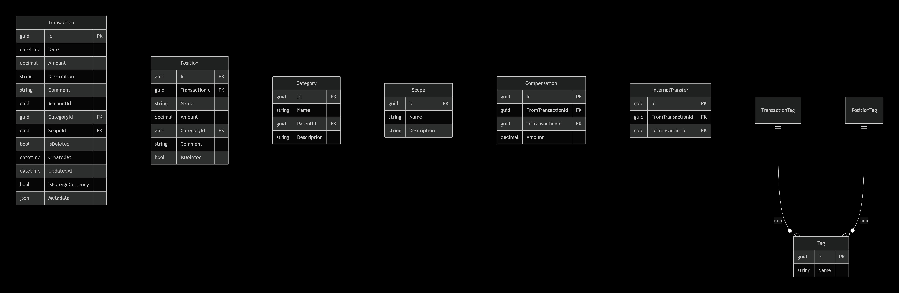

# Доменные модели FinancialDiscipline

## Обозначения
- `Guid` – глобально уникальный идентификатор.
- `decimal` – денежная сумма с фиксированной точностью.
- `DateTime` – дата и время (UTC).
- `null` / `optional` – поле может отсутствовать.

## Сущности и связи



## Описание сущностей

### 1. Transaction (транзакция)

| Поле                | Тип          | Обязательное | Описание |
|---------------------|--------------|--------------|----------|
| Id                  | Guid         | Да | Уникальный идентификатор |
| Date                | DateTime     | Да | Дата и время операции |
| Amount              | decimal      | Да | Сумма (положительная – доход, отрицательная – расход). Не может быть 0. |
| Description         | string       | Да | Исходное описание из выгрузки или введённое пользователем |
| Comment             | string?      | Нет | Произвольный комментарий пользователя |
| AccountId           | string?      | Нет | Идентификатор счёта/карты (например, последние 4 цифры) |
| CategoryId          | Guid?        | Нет | Ссылка на укрупнённую категорию (необязательно) |
| ScopeId             | Guid?        | Нет | Ссылка на группу (scope) – транзакция может быть только в одном scope |
| IsDeleted           | bool         | Да | Мягкое удаление. По умолчанию false. |
| CreatedAt           | DateTime     | Да | Дата создания записи в системе |
| UpdatedAt           | DateTime     | Да | Дата последнего изменения |
| IsForeignCurrency   | bool         | Да | true, если валюта операции не RUB. Такие транзакции исключаются из основного анализа. |
| Metadata            | json         | Нет | Дополнительные пары ключ-значение (MCC, кэшбэк и пр.) |
| **TransactionType** | string       | **Вычисляемое** | Хранится в БД, автоматически пересчитывается при вставке/обновлении по правилам:<br>• Если транзакция участвует в любом InternalTransfer → `InternalTransfer`<br>• Иначе если Amount > 0 → `Income`<br>• Иначе (Amount < 0) → `Expense` |

### 2. Position (позиция)

| Поле             | Тип          | Обязательное | Описание |
|------------------|--------------|--------------|----------|
| Id               | Guid         | Да | Уникальный идентификатор |
| TransactionId    | Guid         | Да | Ссылка на транзакцию-владельца |
| Name             | string       | Да | Наименование товара/услуги |
| Amount           | decimal      | Да | Стоимость позиции (знак соответствует транзакции) |
| CategoryId       | Guid?        | Нет | Детальная категория |
| Comment          | string?      | Нет | Комментарий к позиции |
| IsDeleted        | bool         | Да | Мягкое удаление |

### 3. Tag (тег)

| Поле | Тип | Описание |
|------|-----|----------|
| Id   | Guid | Уникальный идентификатор |
| Name | string | Название тега. **Уникально** в пределах системы (при создании с дублирующимся именем – ошибка). |

### 4. Category (категория)

| Поле        | Тип     | Описание |
|-------------|---------|----------|
| Id          | Guid    | Уникальный идентификатор |
| Name        | string  | Название категории |
| ParentId    | Guid?   | Ссылка на родительскую категорию (null – корневая) |
| Description | string? | Описание |

### 5. Scope (группа)

| Поле        | Тип     | Описание |
|-------------|---------|----------|
| Id          | Guid    | Уникальный идентификатор |
| Name        | string  | Название группы (например, "8 марта") |
| Description | string? | Описание |

### 6. Compensation (компенсация)

| Поле               | Тип     | Описание |
|--------------------|---------|----------|
| Id                 | Guid    | Уникальный идентификатор |
| FromTransactionId  | Guid    | Транзакция, которая компенсирует (например, возврат долга) |
| ToTransactionId    | Guid    | Транзакция, которую компенсируют (исходный расход) |
| Amount             | decimal | Сумма компенсации (≤ |Amount| целевой транзакции) |

### 7. InternalTransfer (внутренний перевод)

| Поле               | Тип     | Описание |
|--------------------|---------|----------|
| Id                 | Guid    | Уникальный идентификатор |
| FromTransactionId  | Guid    | Транзакция списания (отрицательная сумма) |
| ToTransactionId    | Guid    | Транзакция зачисления (положительная сумма) |

## Бизнес-правила

1. Сумма транзакции не может быть равна нулю.
2. Теги уникальны по имени.
3. Компенсация не может превышать абсолютную сумму целевой транзакции.
4. Транзакция может принадлежать только одному Scope.
5. Мягкое удаление (IsDeleted). Физически не удаляем.
6. InternalTransfer: FromTransactionId должна быть отрицательной, ToTransactionId – положительной.
7. При анализе с IncludeChildren подкатегории включаются рекурсивно.
8. Дубликаты при импорте определяются по настраиваемым полям (по умолчанию Date, Amount, Description, AccountId).
9. Транзакции с валютой не RUB помечаются IsForeignCurrency и не участвуют в основных отчётах.

## Интерфейсы репозиториев (контракты)

Интерфейсы работают именно с доменными моделями  
Методы репозиторев делаем асинхронными

```cs
interface ITransactionRepository {
    Transaction? GetById(Guid id, bool includeDeleted = false);
    IEnumerable<Transaction> GetByFilter(TransactionFilter filter);
    void Add(Transaction transaction);
    void Update(Transaction transaction);
    void Delete(Guid id);
    void Restore(Guid id);
}

interface ITagRepository {
    Tag? GetById(Guid id);
    IEnumerable<Tag> GetAll();
    Tag? GetByName(string name);
    void Add(Tag tag);
    void Update(Tag tag);
    void Delete(Guid id);
}
```

// Аналогично для ICategoryRepository, IScopeRepository, ICompensationRepository, IInternalTransferRepository

TransactionFilter содержит: DateFrom, DateTo, CategoryIds (с IncludeChildren), TagIds, ScopeId, TransactionType, AccountId, OnlyNotDeleted, AmountFrom, AmountTo.